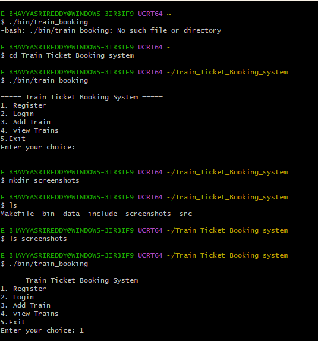
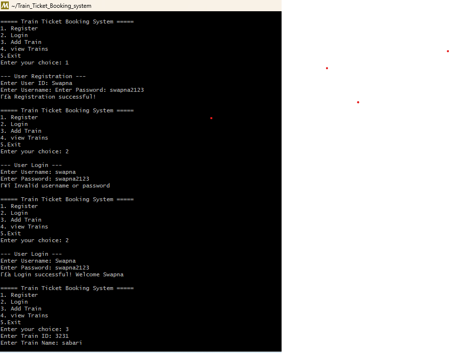
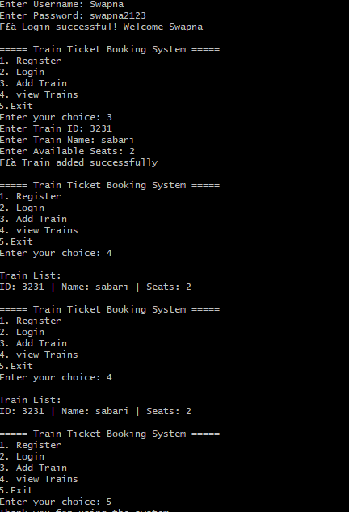

## 📸 Screenshots

### Home Screen

### Login Screen

### Ticket Booking

# 🚆 Train Ticket Booking System (C)

A console-based **Train Ticket Booking System** developed in **C**, designed to simulate real-world railway reservation functionality.  
The application allows users to **register, login, book tickets, cancel bookings, and view booking history**, with persistent storage using file handling.

This project demonstrates strong fundamentals in **C programming, data structures, and software engineering practices**.

---

## 🛠 Tech Stack

- **Language:** C  
- **Core Concepts:**  
  - Structures  
  - File Handling  
  - Pointers  
  - Linked List  
- **Build Tool:** Makefile  
- **Platform:** Windows / Linux (Terminal-based)

---

## ✨ Features

- 🔐 User Registration & Login Authentication  
- 🚄 Train Management using Linked List  
- 🎟 Ticket Booking System  
- ❌ Ticket Cancellation  
- 📜 Booking History Tracking  
- 💾 Persistent Data Storage using Files  
- 🧩 Modular & Clean Code Structure  

---

## 📂 Project Structure
Train-Ticket-Booking-System/
│
├── src/ # Source code
│ └── main.c
│
├── include/ # Header files
│ └── structures.h
│
├── data/ # Data storage files
│ └── users.txt
│
├── screenshots/ # Application screenshots
│ ├── start.png
│ ├── login.png
│ └── booking.png
│
├── bin/ # Compiled binaries (ignored in Git)
│
├── Makefile # One-command build
├── .gitignore
└── README.md

### 2️⃣ Navigate to the Project Directory

cd Train-Ticket-Booking-System

### 3️⃣ Compile the Program

make

### 4️⃣ Run the Application

./train_booking

---

## 📸 Screenshots

### 🔹 Start Menu

### 🔹 Login Screen

### 🔹 Ticket Booking

---

## 🔁 Application Flow

Start
↓
User Registration / Login
↓
Main Menu
↓
Book Ticket / Cancel Ticket / View Booking History
↓
Save Data to File
↓
Exit

---

## 🚀 Future Enhancements

- Seat availability & allocation system  
- Admin panel for train management  
- Password encryption  
- Database integration (MySQL / SQLite)  
- GUI-based application  

---

## 👩‍💻 Author

**Bhavyasri Evuri**  
Information Technology Student  

---

## 📌 Why This Project?

This project was built to:
- Apply **C programming concepts in a real-world scenario**
- Gain hands-on experience with **file handling and data structures**
- Create an **interview-ready software engineering project**
- Showcase clean code and modular design on GitHub

---

⭐ If you find this project useful, feel free to star the repository!
